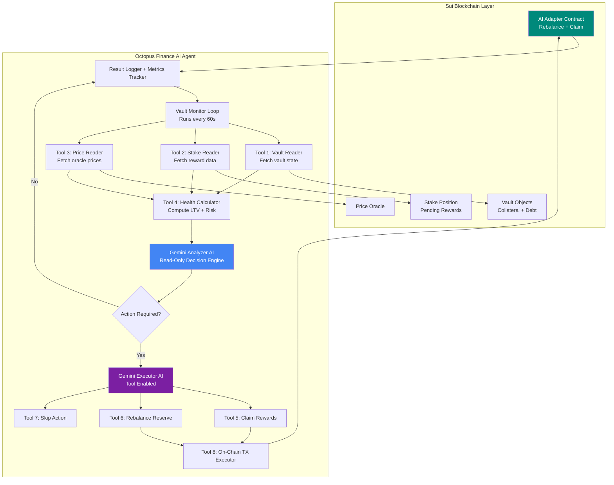

# 🤖 Octopus Finance AI Agent

An autonomous AI-powered vault management agent that protects user CDPs from liquidation using Google Gemini for intelligent decision-making and Sui blockchain for on-chain execution.

## 🎯 What This Agent Does

The AI Agent monitors all authorized vaults and automatically:
1. **Watches LTV ratios** in real-time
2. **Analyzes vault health** using AI (Gemini)
3. **Claims staking rewards** when needed
4. **Deposits rewards as collateral** to reduce LTV
5. **Prevents liquidation** before it happens

**Key Insight**: Users stake MOCKSUI → get octSUI (LST) → deposit as collateral → borrow octUSD. As they earn staking rewards, the AI can automatically claim those rewards and add them to the vault's collateral, reducing LTV and keeping the vault healthy.

---

## 🏗️ Architecture



### Dual API Strategy (Cost Optimization)

| Agent | Purpose | Frequency | API Cost |
|-------|---------|-----------|----------|
| **Analyzer** | Read-only analysis | Every 60s per vault | Low (no tools) |
| **Executor** | On-chain transactions | Only when needed | Higher (with tools) |

This design minimizes API costs by only calling the Executor when the Analyzer determines action is actually needed.

---

## 📁 File Structure

```
src/
├── index.ts                 # Entry point - starts the monitoring loop
├── monitor.ts               # Single-run mode for testing
│
├── config/
│   └── index.ts             # Loads .env config, defines constants
│                            # - Package IDs, Object IDs
│                            # - LTV thresholds (60%, 65%, 70%, 80%)
│                            # - Rate limits
│
├── services/
│   ├── sui-service.ts       # All Sui blockchain interactions
│   │                        # - getVault() - read vault state
│   │                        # - getStakePosition() - read stake data
│   │                        # - getPrice() - read oracle price
│   │                        # - executeClaimAndRebalance() - TX execution
│   │                        # - calculateVaultHealth() - compute metrics
│   │
│   └── vault-monitor.ts     # Main monitoring loop
│                            # - Discovers authorized vaults
│                            # - Collects health metrics
│                            # - Orchestrates Analyzer → Executor flow
│
├── agents/
│   ├── analyzer.ts          # Gemini-powered analysis (READ-ONLY)
│   │                        # - Receives vault health metrics
│   │                        # - Uses AI to decide: MONITOR vs CLAIM_REWARDS
│   │                        # - Returns AnalysisResult with recommended action
│   │                        # - Falls back to rule-based if AI fails
│   │
│   └── executor.ts          # Gemini-powered execution (WITH TOOLS)
│                            # - Called only when action needed
│                            # - Uses function calling to select tool
│                            # - Manages vault cooldowns (prevent spam)
│
├── tools/
│   ├── definitions.ts       # Gemini function declarations
│   │                        # - claim_and_rebalance: Claim + deposit rewards
│   │                        # - rebalance_from_reserve: Use existing reserve
│   │                        # - skip_action: Explicitly decline
│   │
│   └── executor.ts          # Tool implementation
│                            # - Maps Gemini tool calls to SuiService methods
│                            # - Handles errors and retries
│
├── types/
│   └── index.ts             # TypeScript type definitions
│                            # - VaultData, StakePositionData
│                            # - VaultHealthMetrics, HealthStatus
│                            # - AnalysisResult, ExecutionResult
│
└── utils/
    ├── index.ts             # Utility functions (formatting, etc.)
    ├── logger.ts            # Structured logging
    └── rate-limiter.ts      # API rate limiting + vault cooldowns
```

---

## 🔧 Smart Contract Integration

The AI Agent calls these functions on the Sui blockchain:

### `ai_adapter::ai_rebalance<T>`
Analyzes vault and emits a rebalance event. Read-only style check.

```move
public entry fun ai_rebalance<T>(
    capability: &AICapability,
    vault: &Vault<T>,
    oracle: &Oracle,
    ctx: &TxContext
)
```

### `ai_adapter::ai_claim_and_rebalance<T>`
**THE MAIN FUNCTION**: Claims staking rewards and deposits them to the vault.

```move
public entry fun ai_claim_and_rebalance<T>(
    capability: &AICapability,
    vault: &mut Vault<T>,
    pool: &mut StakingPool<MOCKSUI>,
    position: &mut StakePosition,
    oracle: &Oracle,
    ctx: &mut TxContext
)
```

**What it does:**
1. Claims pending rewards from `StakePosition`
2. Mints octSUI for the rewards
3. Deposits octSUI into `Vault.reward_reserve`
4. Reserve can be moved to collateral (future: auto-move)

### Authorization Flow

Before the AI can act on a vault:
1. User calls `ai_adapter::authorize_ai()` → Creates `AICapability`
2. User calls `liquid_staking::enable_auto_rebalance()` → Links vault to position
3. AI Agent receives the `AICapability` object ID in config

---

## 🧠 AI Decision Logic

### LTV Thresholds

| LTV Range | Health Status | AI Action |
|-----------|---------------|-----------|
| < 60% | `HEALTHY` | `MONITOR` - No action needed |
| 60-65% | `WARNING` | `CLAIM_REWARDS` if rewards available |
| 65-70% | `AT_RISK` | `REBALANCE` - Urgent claim |
| 70-80% | `CRITICAL` | `URGENT_REBALANCE` - Emergency |
| > 80% | `LIQUIDATABLE` | Too late - vault can be liquidated |

### Analyzer Prompt

```
You are an AI analyst for Octopus Finance.
Analyze this vault and decide if action is needed.

LTV: 67.5%
Pending Rewards: 5.2 octSUI
Reserve: 0 octSUI
Debt: 175 octUSD
Collateral Value: $315

RESPOND IN JSON:
{
  "shouldAct": true,
  "action": "CLAIM_REWARDS",
  "reasoning": "LTV above warning threshold, rewards available",
  "confidence": 0.92
}
```

### Executor Tools

The Executor Agent has access to these Gemini function calls:

| Tool | When to Use |
|------|-------------|
| `claim_and_rebalance` | LTV > 60%, rewards available |
| `rebalance_from_reserve` | LTV > 65%, reserve has funds |
| `skip_action` | Vault healthy or no funds available |

---

## ⚙️ Configuration

### Environment Variables

```env
# Gemini API Keys (get from https://aistudio.google.com/)
GEMINI_ANALYZER_API_KEY=your_key  # For read-only analysis
GEMINI_EXECUTOR_API_KEY=your_key  # For tool execution

# Sui Network
SUI_NETWORK=testnet

# AI Agent's wallet (this wallet executes transactions)
AI_PRIVATE_KEY=suiprivkey1...

# Contract addresses (from deployment)
PACKAGE_ID=0x368ebff32f52eda8b904bf3a8938483b493c65e787ee43fb34c5986348db40c5
STAKING_POOL_ID=0x3e2fcdce65c711a2a91e624fceadd913dc9e94797c464890f60ca116676dca20
ORACLE_ID=0xfde27ee67984571453853b7142d2322c5fea9640b24d4c9e21266bc42790f8ac
AI_CAPABILITY_ID=0x4cebcfd52c8c1f7726832f63d6a9b8ef3b897bf7a1f1e158e7144252fbe2e1be

# Monitoring
MONITOR_INTERVAL_SECONDS=60      # How often to check vaults
MIN_REBALANCE_INTERVAL_SECONDS=300  # Cooldown between actions on same vault

# Rate limits (protect against API abuse)
ANALYZER_MAX_RPM=10
EXECUTOR_MAX_RPM=5
```

---

## 🚀 Running the Agent

### Development

```bash
# Install dependencies
npm install

# Copy and configure environment
cp .env.example .env
# Edit .env with your API keys and private key

# Run in development mode (with hot reload)
npm run dev
```

### Production

```bash
# Build TypeScript
npm run build

# Run compiled JavaScript
npm start
```

### Single Run (Testing)

```bash
# Run one monitoring cycle and exit
npm run monitor
```

---

## 🔒 Security Model

The AI Agent is designed with **minimal permissions**:

| Can Do ✅ | Cannot Do ❌ |
|-----------|-------------|
| Read vault state | Withdraw collateral |
| Claim staking rewards | Borrow more octUSD |
| Deposit rewards to reserve | Transfer user funds |
| Emit events | Access other vaults |

The `AICapability` object is specific to one vault and one AI agent address. It's created by the user and can be revoked at any time.

---

## 🐛 Troubleshooting

### "Insufficient gas"
```bash
# Fund the AI agent wallet
sui client transfer --to 0x0d0470eaa28a8834e696732d01f5bd68f6e382c36c3c7a94e3006d1a49beb926 --amount 1000000000
```

### "E_NOT_AUTHORIZED"
The vault owner hasn't authorized this AI agent. They need to call:
```bash
sui client call --package $PACKAGE_ID --module ai_adapter --function authorize_ai \
  --args $VAULT_ID $AI_AGENT_ADDRESS
```

### "No vaults found"
1. Check that `AI_CAPABILITY_ID` is correct in `.env`
2. Verify the AICapability object exists on-chain
3. Ensure the user has enabled auto-rebalance on their stake position

### Rate limit errors
Reduce polling frequency:
```env
MONITOR_INTERVAL_SECONDS=120
ANALYZER_MAX_RPM=5
```

---

## 📊 Monitoring Output

```
[2026-01-28 18:30:00] INFO: Starting monitoring cycle...
[2026-01-28 18:30:01] INFO: Found 3 authorized vaults
[2026-01-28 18:30:02] INFO: Vault 0x4afb6d... LTV: 42%, Status: HEALTHY
[2026-01-28 18:30:02] INFO: Vault 0x7c2e1a... LTV: 68%, Status: AT_RISK
[2026-01-28 18:30:03] INFO: Analyzer: Vault 0x7c2e1a needs CLAIM_REWARDS
[2026-01-28 18:30:04] INFO: Executor: Calling claim_and_rebalance
[2026-01-28 18:30:07] INFO: ✅ TX Success: 5.2 octSUI deposited to reserve
[2026-01-28 18:30:07] INFO: Vault 0x9f3b8c... LTV: 55%, Status: HEALTHY
[2026-01-28 18:30:07] INFO: Cycle complete. Next run in 60s
```

---

## 📄 License

MIT
